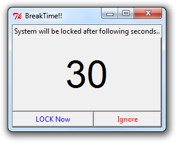
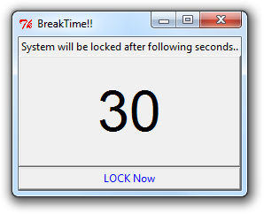

# breaktime
Reminder for BreakTime !!

## Parameters (with default values) :
> _All Parameter values are in seconds._ With default values, it reminds to take a break of 4 minute on every 50 (, 54 and 58) minutes. 
* BREAKTIME = 4\*60
	* If system unlocked before this breaktime then start notifications again to lock system
* SYSTEM_LOCK_NOTIFICATION_LIST = \[ 50\*60, 54\*60, 58\*60 \]
	* Threshold to lock system with pop-up notification, possible to ignore upto last notification
* SYSTEM_CHECK_INTERVAL = 2\*60
	* Checking(if system is locked or not) interval
* SYSTEM_CHECK_INTERVAL_REDUCED = 15\*60
	* Reduced checking interval for locked system (after same interval)
* NOTIFICATION_TIMER_INIT = 30
	* System lock Notification timer initialization time/value
  
## Supported OS :
* Window

## Flow of Program :
1. Check for system status (lock or unlock) on every SYSTEM_CHECK_INTERVAL
2. Pop-up notification on every SYSTEM_LOCK_THRESHOLD_LIST interval
3. It is possible to ignore upto last notification from SYSTEM_LOCK_THRESHOLD_LIST, then system should be lock for BREAKTIME interval 
4. If system will unlocked before BREAKTIME interval then it will pop-up notification to lock system (step 2)
5. For locked system, Checking interval will reduce by SYSTEM_LOCKED_REDUCED_THRESHOLD factor, after SYSTEM_LOCKED_REDUCED_THRESHOLD interval

## Screenshots :

